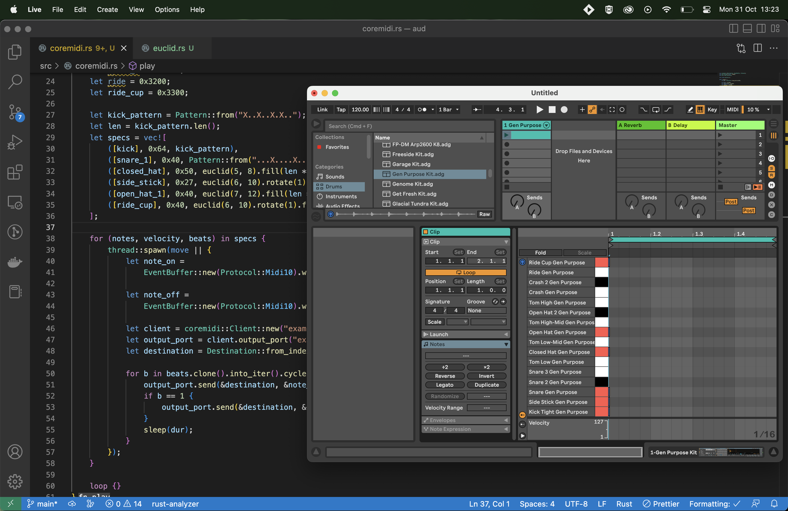

# Generating MIDI sequences from Rust and sending them to Ableton to play

1. Make sure that you have a virtual MIDI device/bus set up (or whatever it is) — in Mac, this means going to "Audio MIDI Setup", then "Window" > "Show MIDI Studio", and then set the "IAC Driver" to "Dvice is online" and make sure there's at least 1 port.
2. Open Ableton and make a MIDI track with e.g. drums on it — I've programmed the notes to work nicely with "Gen Purpose Kit.adg"
3. Run the code :)

